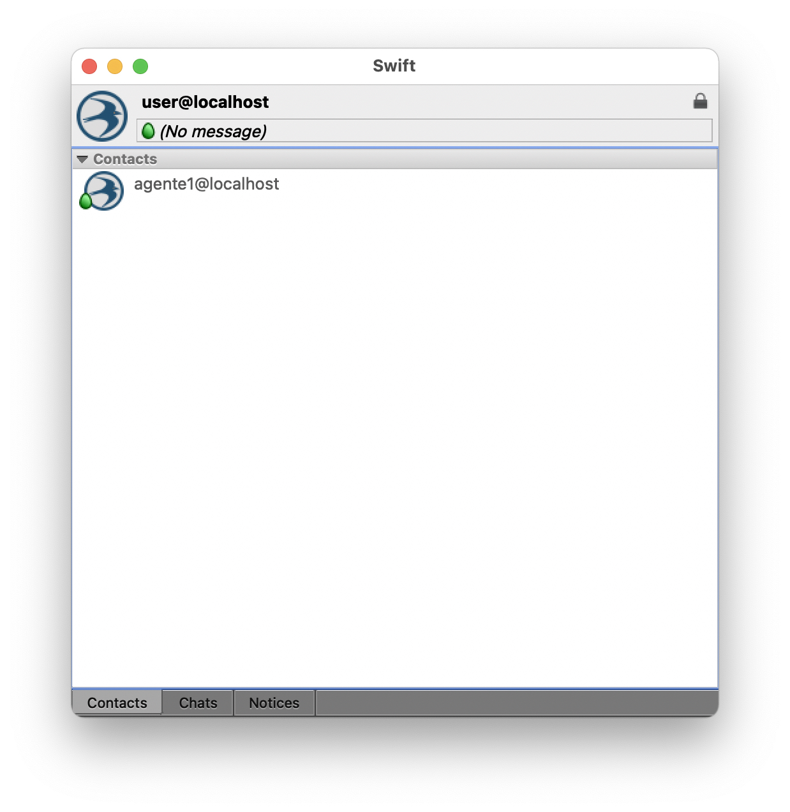

## MANUAL CHAT USUARIO

Este es un pequeño manual para instalar el cliente XMPP para poder interactuar con el asistente (Agente 1).

El cliente a utilizar se encuentra en: https://swift.im/

## Pasos a seguir

1. Crear una nueva cuenta en el servidor de XMPP. Para esto, se asume que ya el servidor está ejecutándose y que se tiene acceso a la cuenta de administrador.
2. Ir al panel de administración: http://localhost:5280/admin/
3. Una vez iniciado sesión como administrador, ir al apartado de usuarios: http://localhost:5280/admin/server/localhost/users/
4. Allí, agregar un nuevo usuario con las siguientes credenciales:
```
usuario: user@localhost
contraseña: qaz123
```
5. Una vez se registre el nuevo usuario, abrir el cliente XMPP Swift. Este solicitará el nombre y contraseña de usuario. Si todo va bien, debería iniciar sesión sin inconvenientes.
6. Para interactuar con el asistente, necesitará actualizar la variable `.env` con el nombre de usuario recién creado. Para eso, mirar el archivo `.env.example`.
7. Finalmente, inicializar los agentes y confirmar que el agente 1 está visible en el tab `contacts` en el cliente XMPP como se puede ver aquí:


Si quieres confirmar que puedes interactuar con el asistente, solo necesitas abrir el contacto y enviarle un mensaje. Este te devolverá el mensaje enviado.